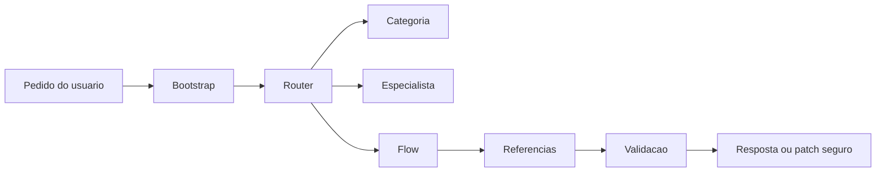

# GPT55 Runtime

<p align="center">
  <strong>Runtime modular para rotear, validar e executar trabalho com Codex de forma mais precisa.</strong>
</p>

<p align="center">
  
</p>

<p align="center">
  <a href="#instalacao">Instalacao</a> ·
  <a href="#uso-rapido">Uso rapido</a> ·
  <a href="#o-que-vem-incluido">Incluido</a> ·
  <a href="#seguranca">Seguranca</a> ·
  <a href="#validacao">Validacao</a>
</p>

<p align="center">
  =18" src="https://img.shields.io/badge/node-%3E%3D18-2f7d32">
  
  
</p>

---

## Visao Geral

`gpt55-runtime` e uma skill portavel para agentes Codex-compativeis. Ela funciona como um roteador operacional: identifica o tipo de pedido, escolhe categoria, especialista, fluxo, referencias e validacoes proporcionais ao risco.

O objetivo e evitar respostas improvisadas, contexto gigante e alteracoes sem verificacao. O runtime fica dividido em arquivos pequenos, carregados sob demanda.



## Para Que Serve

- Escolher a rota correta antes de implementar.
- Separar trabalho por dominio: frontend, backend, security, design, Android, AI agents, gamedev, escrita, financeiro, pesquisa e outros.
- Manter referencias grandes fora do `SKILL.md`.
- Validar comportamento antes de dizer que algo esta pronto.
- Instalar/sincronizar a skill sem ativar MCPs, plugins ou ferramentas externas automaticamente.

## Instalacao

Requisito:

- Node.js 18 ou superior.

Instalacao padrao:

```bash
npx github:NewtonAlves/gpt55-runtime
```

Destino padrao:

| Sistema | Destino |
|---|---|
| Windows | `%USERPROFILE%\.agents\skills\gpt55-runtime` |
| macOS/Linux | `$HOME/.agents/skills/gpt55-runtime` |

Sincronizar tambem com Codex:

```bash
npx github:NewtonAlves/gpt55-runtime --sync-codex
```

Destino extra:

| Sistema | Destino Codex |
|---|---|
| Windows | `%USERPROFILE%\.codex\skills\gpt55-runtime` |
| macOS/Linux | `$HOME/.codex/skills/gpt55-runtime` |

O instalador cria backup timestampado antes de sobrescrever uma instalacao existente.

## Uso Rapido

Validar o payload antes de instalar:

```bash
npx github:NewtonAlves/gpt55-runtime validate
```

Verificar dependencias opcionais:

```bash
npx github:NewtonAlves/gpt55-runtime doctor
```

Instalar e sincronizar com Codex:

```bash
npx github:NewtonAlves/gpt55-runtime --sync-codex
```

Remover sem apagar definitivamente:

```bash
npx github:NewtonAlves/gpt55-runtime uninstall
```

O uninstall move a skill instalada para um backup com timestamp.

## Comandos Locais

Para desenvolvimento dentro deste repositorio:

```bash
node scripts/validate.mjs
node scripts/doctor.mjs
node scripts/install.mjs --dry-run --sync-codex
npm pack --dry-run
```

No Windows, se o PowerShell bloquear `npm.ps1`, use:

```powershell
npm.cmd pack --dry-run
```

## O Que Vem Incluido

```text
payload/gpt55-runtime/
  SKILL.md
  agents/
  runtime/
  categories/
  specialists/
  flows/
  references/
  registries/
  validation/
  updates/
```

Principais partes:

| Area | Funcao |
|---|---|
| `SKILL.md` | Entrada curta da skill e regras de carregamento progressivo. |
| `runtime/` | Politicas de bootstrap, roteamento, precisao, fontes, risco e execucao. |
| `categories/` | Categorias como frontend, backend, security, design, AI agents e outras. |
| `specialists/` | Papeis especializados acionados por rota. |
| `flows/` | Fluxos operacionais para executar ou revisar tarefas. |
| `references/` | Guias sob demanda, sem transformar a skill em dump. |
| `registries/` | Matrizes de rota, categorias, specialists, referencias e skills. |
| `validation/` | Testes de comportamento esperado do runtime. |
| `updates/` | Guias de update, sync e manutencao. |

## Rotas Em Destaque

### PHP + HTML + CSS + JavaScript

A Phase 14 adicionou suporte operacional para projetos PHP vanilla:

- `flows/php-fullstack-flow.md`
- `references/dev-examples/php-html-css-js-guide.md`
- `specialists/php-modern.md`
- `specialists/vanilla-web.md`
- `validation/php-html-css-js-tests.md`

Use essa rota para:

- CRUD PHP + PDO + MySQL;
- login, cadastro e sessao;
- uploads seguros;
- formularios PHP;
- HTML/CSS/JavaScript sem framework;
- Fetch API integrada com endpoints PHP;
- mini apps administrativos.

Ela nao substitui rotas especificas de Laravel, Symfony, WordPress, React, Next.js ou Node.

### Update e Sync

O fluxo de update segue a regra:

```text
auditar -> aplicar patch minimo -> validar -> sincronizar -> relatar
```

Sync seguro:

- valida o payload antes de copiar;
- cria backup antes de sobrescrever;
- nao copia `Plano/`, `.git`, backups, logs, `.env`, `config.toml` ou arquivos temporarios;
- nao instala MCPs, plugins ou ferramentas externas.

## Como Usar No Codex

Depois de instalado, chame a skill pelo nome quando quiser que o agente use o roteador:

```text
$gpt55-runtime revise este projeto e escolha o fluxo correto antes de editar
```

Exemplos de pedidos:

```text
$gpt55-runtime audite se esta mudanca deve ir para frontend, backend ou security
$gpt55-runtime planeje uma fase segura antes de implementar
$gpt55-runtime revise se o payload da skill esta pronto para GitHub/npx
$gpt55-runtime crie um CRUD PHP com PDO seguindo a rota PHP vanilla
```

## Seguranca

O instalador nao faz:

- instalacao de MCPs;
- ativacao de plugins;
- configuracao de `config.toml`;
- instalacao de GSD, Open Design, Context7 ou skills externas;
- leitura ou copia de `.env`;
- publicacao em npm.

Arquivos sensiveis e locais ficam fora do pacote por regra.

Antes de sobrescrever uma skill instalada, o instalador move a versao anterior para:

```text
gpt55-runtime.backup-YYYYMMDD-HHMMSS
```

## Validacao

Validacao estrutural:

```bash
npx github:NewtonAlves/gpt55-runtime validate
```

Saida esperada:

```text
Validation target: .../payload/gpt55-runtime
OK: structure is valid.
```

Diagnostico read-only:

```bash
npx github:NewtonAlves/gpt55-runtime doctor
```

O `doctor` apenas detecta dependencias opcionais. Ele nao instala nem ativa nada.

## Troubleshooting

### `npx` nao encontra o pacote

Confirme que o repositorio esta acessivel:

```bash
npx github:NewtonAlves/gpt55-runtime validate
```

### A instalacao falhou na validacao

Rode:

```bash
npx github:NewtonAlves/gpt55-runtime validate
```

Depois confira se `payload/gpt55-runtime` contem `SKILL.md`, `runtime/`, `categories/`, `flows/`, `references/`, `registries/`, `validation/` e `updates/`.

### A skill antiga sumiu

Ela deve estar em um backup timestampado ao lado do destino instalado:

```text
gpt55-runtime.backup-*
```

## Estrutura Do Repositorio

| Caminho | Papel |
|---|---|
| `payload/gpt55-runtime/` | Skill distribuida por GitHub/npx. |
| `scripts/install.mjs` | Instalador portavel e sincronizador. |
| `scripts/validate.mjs` | Validador estrutural do payload. |
| `scripts/doctor.mjs` | Diagnostico read-only de dependencias opcionais. |
| `scripts/uninstall.mjs` | Desinstalador conservador com backup. |
| `docs/` | Documentacao complementar. |

Pastas locais como `Plano/` e `gpt55-runtime/` fonte nao fazem parte do pacote publicado.

## Licenca

MIT. Veja `LICENSE`.
